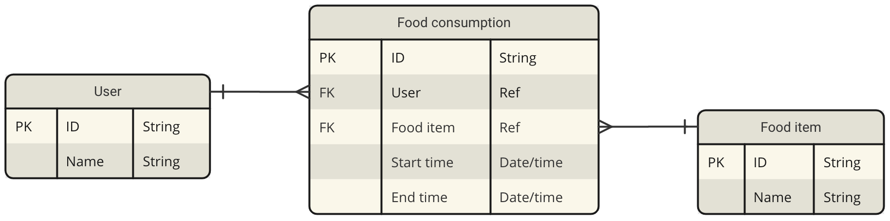
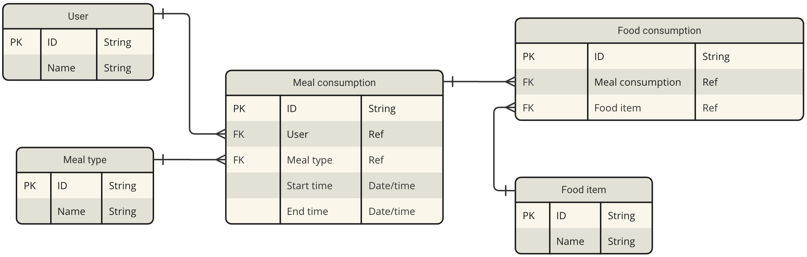
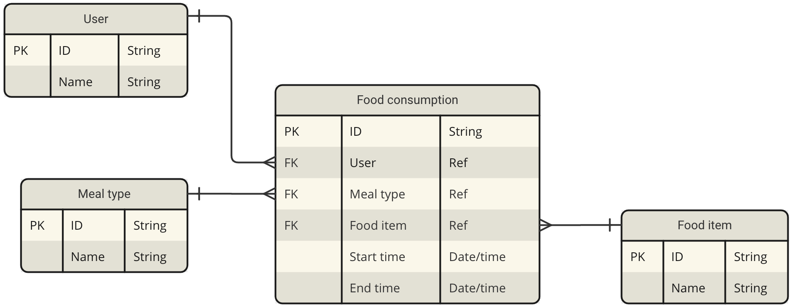

## Introduction
Data modelling in real world applications often go beyond what is mentioned in the textbooks.
```
1. Transactional data - Normalize
2. Aggregated data - De-normalize
```
Along with technical skills, it takes functional knowledge to envision how different entities interact among themselves. Several factors come into play while trying to optimize `cost vs benefit`.

## Understanding requirements
Understanding customer requirements is the key to provide delightful experiences. However, the initial requirements often come as a high level abstract statement, like
```
I want to capture the food items consumed in a day by the users of my app.
```
It is very important to come up with the specific technical requirements and set the expectations clear before jumping on to any solution. It also requires social skills to connect with various stakeholders, ask them the right questions and avoid any invalid assumptions. Let's try to continue from the provided high level statement.
```
Ques : How many total users are registered with the app?
Ans : Around 10 thousand.

Ques : How many users are expected to log their food consumption in the app per day?
Ans : Around 1000.

Ques : How many different food items are expected to be present in the app?
Ans : Around 1000.

Ques : How will the captured data used?
Ans : We are planning to ingest the data to a recommendation engine that will suggest food items based on one's habits and nutritional requirements. For that, we will also need large volumes of data and a data warehouse to run aggregation queries efficiently.

Ques : How much history data do you need to preserve for the daily consumptions?
Ans : The data warehouse is going to store aggregated historical data. Preserving daily transactional data for a week is good enough.
```
Based on the above points, we can make some derivations.
```
Master data - `Users`, `Food items`.
`m` users can consume `n` food items.
Transactional data - `Food consumption`
Average number of food items per user per day - 10
Average data volume for `Food consumption` = 7 days * 1000 users * 10 food items = 70,000.
The above constraints make it a good fit to use `Relational Data Base Management System`.
```

## Solution 1



### Analysis
At any particular time, users consume multiple food items. As `Start time` and `End time` are going to be redundant, we can look for further normalization.

## Solution 2



### Analysis
It involves four tables (three joins) to find out which food item is consumed by any particular user. Moreover, the number of different food items in a single meal is five on an average. Sometimes, a user can also consume only a single food item, for example, an apple as a snack. Forcing them to log the meal type everytime may not be a good experience.

## Solution 3



### Analysis
Users tend to consume similar food items for a particular meal. `Meal type` is going to be an important attribute for analyzing food habits as there is a strong co-relation among `Meal type` and `Food items` for a user.

## Conclusion
`Solution 3` seems to be the most suitable option as it fulfills all the requirements.